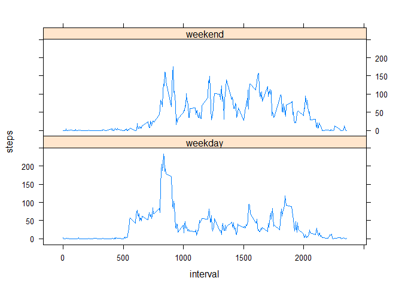

# Reproducible Research: Peer Assessment 1


## Loading and preprocessing the data

```r
suppressMessages(library(dplyr))
library(lubridate)
library(ggplot2)
library(lattice)

activities <- read.csv("activity.csv", header = TRUE)
activities$date <- ymd(activities$date)
```


## What is mean total number of steps taken per day?

```r
stepsByDay <- summarize(group_by(activities, date), sum(steps, na.rm = TRUE))
names(stepsByDay) <- c("date", "steps")
hist(stepsByDay$steps, breaks = 20, col = "red", main = "Histogram of the total number of steps taken each day", xlab = "Steps in a day")
```

 

```r
avgSteps <- mean(stepsByDay$steps)
medSteps <- median(stepsByDay$steps)
```
- The mean of total number of steps taken each day is **9354.2295082**.
- The median of total number of steps taken each day is **10395**.


## What is the average daily activity pattern?

```r
avgStepsByInterval <- summarize(group_by(activities, interval), mean(steps, na.rm = TRUE))
names(avgStepsByInterval) = c("interval", "steps")
qplot(x = avgStepsByInterval$interval, y = avgStepsByInterval$steps, 
      geom = c("point", "line"), xlab = "Interval", ylab = "Steps", title = "average number of steps taken, averaged across all days")
```

 

```r
maxIntervalRow <- avgStepsByInterval[which(avgStepsByInterval$steps == max(avgStepsByInterval$steps)),]
maxInterval <- round(maxIntervalRow$interval, digits = 3)
maxSteps <- round(maxIntervalRow$steps, digits = 3)
```

- the 5-minute interval (on average across all the days in the dataset), which contains the maximum number of steps is **835**.
- in this interval the number of steps is **206.17**.


## Imputing missing values
(NAs filled with the mean for that 5-minute interval)


```r
numOfNAs <- nrow(filter(activities, is.na(steps)))
```
- The total number of missing values in the dataset is **2304**.


```r
avgStep <- function(interval, steps) {
  val <- if(is.na(steps)) as.numeric(avgStepsByInterval[interval, "steps"]) else steps
  if(is.na(val)) val <- 0
  val
}

activitiesFilled <- activities
for(i in 1: nrow(activitiesFilled)) {
  activitiesFilled[i, "steps"] <- avgStep(activitiesFilled[i, "interval"], 
                                        activitiesFilled[i, "steps"])
}

stepsByDayImproved <- summarize(group_by(activitiesFilled, date), sum(steps))
names(stepsByDayImproved) <- c("date", "steps")
hist(stepsByDayImproved$steps, breaks = 20, col = "red", main = "Total number of steps taken each day (missing data filled)", xlab = "Steps in a day")
```

 

```r
avgStepsImproved <- round(mean(stepsByDayImproved$steps), digits = 0)
medStepsImproved <- round(median(stepsByDayImproved$steps), digits = 2)
```
- The mean of total number of steps taken each day is **9545**.
- The median of total number of steps taken each day is **10395**.
- *Mean differs from the numbers calculated from raw data.*

## Are there differences in activity patterns between weekdays and weekends?

```r
activities <- mutate(activities, daytype = ifelse(wday(date) == 1 | wday(date) == 7, "weekend", "weekday"))

avgStepsByIntervalWday <- summarize(group_by(activities, daytype, interval), mean(steps, na.rm = TRUE))
names(avgStepsByIntervalWday) = c("daytype", "interval", "steps")

xyplot(steps ~ interval | daytype, data = avgStepsByIntervalWday, layout = c(1, 2), type = "l", title = "Differences between daily activities by day type")
```

 

